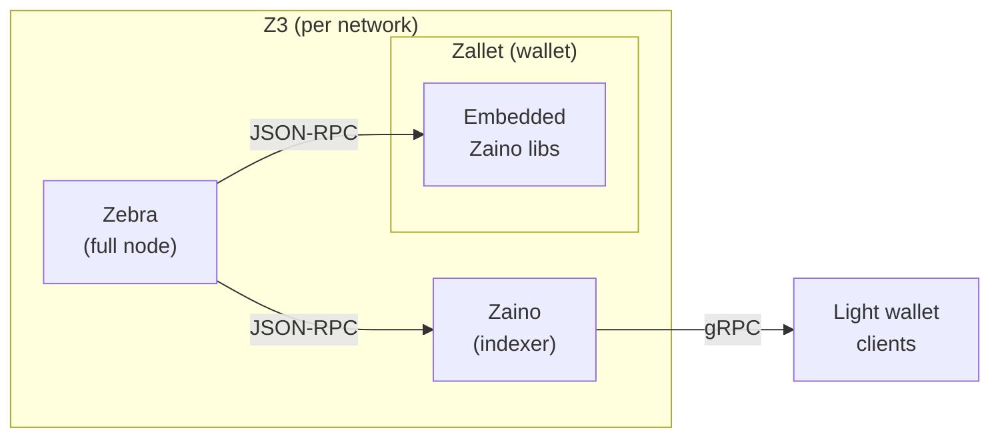

# Z3: a Zcash node platform

Z3 runs **Zebra** (full node), **Zaino** (indexer), and **Zallet** (wallet) together with Docker Compose, on mainnet, testnet, or a local regtest network.

Two kinds of people use Z3, and this README is split for them:

- **Operators** run the stack as infrastructure. Start at [Choose your network](#choose-your-network); everything you need to run Z3 is in that half.
- **Developers, testers, and researchers** build or test against Z3, often running several networks at once. Start at [Building and testing against Z3](#building-and-testing-against-z3).

## Prerequisites

- [Docker Engine](https://docs.docker.com/engine/install/) with [Docker Compose](https://docs.docker.com/compose/install/) (v2.24.4+)
- [rage](https://github.com/str4d/rage/releases) for generating Zallet encryption keys (`brew install rage` on macOS, or download a release)
- Git, to clone this repository
- `openssl`, only for regtest (it hashes the regtest wallet RPC password); pre-installed on macOS and most Linux distros

## For operators

### Choose your network

Z3 runs as one of three independent Compose projects. Pick by what you are doing:

| Network | Use it for | First sync | Real funds |
|---------|-----------|------------|------------|
| **mainnet** | Production: the real Zcash chain | 24-72 hours | Yes |
| **testnet** | Staging against the public test network | 2-12 hours | No (test ZEC) |
| **regtest** | Local practice and development: instant blocks, no peers, no sync | Seconds | No |

All three can run at once on one host; each gets its own ports and volumes. New to Z3? Start with **regtest** to watch the whole stack come up in seconds, then move to mainnet.

### Quick start

Each network has a one-time setup step and a start step.

**Mainnet (production).** Zebra must sync the whole chain before Zaino and Zallet can serve clients, so the boot is two-phase: start Zebra, wait for the sync, then start the rest.

```bash
git clone https://github.com/ZcashFoundation/z3 && cd z3

# 1. One-time setup: creates local config files and the Zallet wallet identity.
./scripts/setup-network.sh mainnet

# 2. Start Zebra and wait for it to sync. The poller exits when Zebra is ready.
docker compose --env-file .env.mainnet up -d zebra
./scripts/check-zebra-readiness.sh

# 3. Start Zaino + Zallet once Zebra is synced.
docker compose --env-file .env.mainnet up -d
```

Images are pulled automatically; no build step or source checkout is needed.

> [!IMPORTANT]
> Running step 3 before Zebra reaches `/ready` makes Zaino and Zallet restart-loop until the sync catches up. The poller in step 2 exits only when Zebra is synced.

Your edits to the per-network config under `config/<network>/` stay local and survive `git pull`.

**Testnet (public test network).** The same two-phase flow; pass the testnet health port to the poller:

```bash
./scripts/setup-network.sh testnet
docker compose --env-file .env.testnet up -d zebra
./scripts/check-zebra-readiness.sh 18080
docker compose --env-file .env.testnet up -d
```

**Regtest (local practice and development).** Regtest mines blocks on demand with no peers, so it boots in seconds. One command does setup, starts Zebra, and mines the activation blocks:

```bash
./scripts/regtest-init.sh
docker compose --env-file .env.regtest up -d
```

After the first run, the `up -d` line alone is enough. See [docs/regtest.md](docs/regtest.md) for test commands and the full workflow.

### Where your data lives

Each network keeps its chain state in a Docker named volume called `z3-<network>-chain`, which lands under Docker's data root (on Linux, `/var/lib/docker/volumes/`). Mainnet is roughly **300 GB**; size the disk before you start.

- **Find the path:** `docker volume inspect z3-mainnet-chain -f '{{.Mountpoint}}'`
- **Put it on another disk:** set `Z3_CHAIN_DATA_PATH=/mnt/ssd/zebra-state` and run `./scripts/fix-permissions.sh zebra /mnt/ssd/zebra-state` before the first start.
- **Back up the wallet:** the only data worth backing up is the wallet, and it needs **two** pieces kept together: the `z3-<network>-zallet` volume **and** `config/<network>/zallet_identity.txt` (the age key the wallet database is encrypted with). One without the other cannot be restored. Chain state is re-syncable and the cookie is regenerated, so neither needs backup.
- **Stop vs wipe:** `docker compose --env-file .env.<network> down` stops the stack and keeps every volume; adding `-v` (`down -v`) deletes them, which means a full re-sync.

The volume table and bind-mount details are in the [Reference](#reference) section.

### Running in production

Z3 ships production-shaped defaults, but a few choices are yours to make before running mainnet for real:

- **Pick where the chain lives.** The default named volume sits under `/var/lib/docker` (~300 GB on mainnet). To use a dedicated disk, set `Z3_CHAIN_DATA_PATH` and run `fix-permissions.sh` before the first start (see [Where your data lives](#where-your-data-lives)).
- **Plan the wallet backup.** Keep the `z3-<network>-zallet` volume and `config/<network>/zallet_identity.txt` together; nothing else needs backup.
- **Set a log rotation policy.** Z3 does not pin a logging driver, so containers use your Docker daemon default. Add size limits in `/etc/docker/daemon.json` (see the [FAQ](docs/faq.md)); otherwise logs grow unbounded on a 24/7 node.
- **Decide p2p exposure.** Mainnet and testnet publish Zebra's p2p port for inbound peers. Behind NAT or a firewall, set `ZEBRA_NETWORK__EXTERNAL_ADDR` to the address peers should dial. Regtest is peerless and publishes no p2p.
- **Tune the host network (Linux).** On a busy mainnet node, default kernel TCP buffer and connection-backlog limits can cap Zebra's peer throughput. See [Zebra's TCP tuning notes](https://github.com/ZcashFoundation/zebra/pull/10513) for the `sysctl` values worth raising.
- **Bound resources on a shared host.** No CPU or memory limits are set by default: right for a dedicated node, easy to get wrong on a shared box. Add `deploy.resources.limits` in an override file if you need them.

Z3 ships safe defaults: pinned image versions (no surprise upgrades), non-root containers with Linux capabilities dropped, health checks that hold the wallet back until the node is synced, and automatic restart. Upgrades stay deliberate: bump the version pin in a reviewed change, or set `Z3_<SERVICE>_IMAGE`.

### Monitoring

Prometheus, Grafana, Jaeger, and AlertManager ship behind a Compose profile. Zebra's metrics are on by default at the in-network `zebra:9999` scrape target.

```bash
docker compose --env-file .env.<network> --profile monitoring up -d
```

Default UI host ports are globally unique across the three networks (mainnet Grafana `3000`, testnet `13000`, regtest `23000`, and so on). Each is overridable: `Z3_GRAFANA_PORT`, `Z3_PROMETHEUS_PORT`, `Z3_ALERTMANAGER_PORT`, `Z3_JAEGER_UI_PORT`.

### Stopping the stack

```bash
docker compose --env-file .env.mainnet down       # stop containers, keep data
docker compose --env-file .env.mainnet down -v    # stop and delete all volumes (full reset)
```

## Building and testing against Z3

You do not need this section to operate Z3. It covers running several networks for test scenarios, how the networks differ, the published service endpoints, and attaching your own services.

### How the networks differ

Operators usually run one network; testers often run several and need to know where they diverge from a deployment standpoint:

| Aspect | mainnet | testnet | regtest |
|--------|---------|---------|---------|
| Peers / p2p | Real peers; p2p published (`8233`) | Test peers; p2p published (`18233`) | Peerless; no p2p |
| Blocks | From the network | From the network | Mined on demand (`generate`) |
| Sync wait before use | Hours to days | Hours | None |
| RPC auth | Cookie file | Cookie file | Username / password |
| In-network Zebra RPC | `zebra:8232` | `zebra:18232` | `zebra:18232` |
| Coexists on one host with | testnet, regtest | mainnet, regtest | mainnet, testnet |

Mainnet pairs cleanly with either other network on one host. Testnet and regtest reuse Zebra's testnet container ports, so they differ only by published host port (the env files keep those unique). The rpc-router, a unified Zebra+Zallet JSON-RPC endpoint, runs only on regtest today.

### Architecture



**Zebra** syncs and validates the Zcash blockchain. **Zaino** provides a lightwalletd-compatible gRPC interface for light wallet clients. **Zallet** embeds Zaino's indexer libraries internally and connects directly to Zebra's JSON-RPC; it does not use the standalone Zaino service.

Image pins live as `${VAR:-tag}` defaults in `docker-compose.yml`; override any pin with `Z3_ZEBRA_IMAGE`, `Z3_ZAINO_IMAGE`, or `Z3_ZALLET_IMAGE`. Upstream sources: [Zebra](https://github.com/ZcashFoundation/zebra), [Zaino](https://github.com/zingolabs/zaino), [Zallet](https://github.com/zcash/wallet).

### Service endpoints

Published host ports are chosen per `.env.<network>` so all networks coexist on one host. The full per-network matrix lives in [`z3-contract.yaml`](z3-contract.yaml).

| Service | Endpoint shape | Env var |
|---------|----------------|---------|
| Zebra RPC | `http://localhost:<port>` | `Z3_ZEBRA_HOST_RPC_PORT` |
| Zebra p2p (inbound peers) | `localhost:<port>` | `Z3_ZEBRA_HOST_P2P_PORT` |
| Zebra health | `http://localhost:<port>/ready` | `Z3_ZEBRA_HOST_HEALTH_PORT` |
| Zaino gRPC (plaintext, no TLS) | `localhost:<port>` | `Z3_ZAINO_HOST_GRPC_PORT` |
| Zaino JSON-RPC | `http://localhost:<port>` | `Z3_ZAINO_HOST_JSON_RPC_PORT` |
| Zallet RPC | `http://localhost:<port>` | `Z3_ZALLET_HOST_RPC_PORT` |

Inside the network, services resolve by DNS name (`zebra`, `zaino`, `zallet`) on Zebra's per-network container ports.

### Attaching your own services

> Operators can skip this. It exists for downstream services, wallets, and tooling that attach to a running Z3 stack, and for agents that consume the API programmatically.

Z3 publishes a stable set of identifiers (network names, volume names, ports, and auth surfaces) so your service can attach by name and keep working across networks. A mainnet or testnet peer attaches over the external network and reads the RPC cookie from the shared volume:

```yaml
networks:
  z3:
    external: true
    name: z3-testnet
volumes:
  z3-cookie:
    external: true
    name: z3-testnet-cookie
services:
  my-app:
    networks: [z3]
    volumes:
      - z3-cookie:/var/run/auth:ro
    environment:
      ZEBRA_RPC_URL: http://zebra:18232
      ZEBRA_COOKIE_PATH: /var/run/auth/.cookie
```

Regtest uses username/password instead of cookie auth; do not mount `z3-regtest-cookie` expecting a readable cookie. For the three attachment patterns (Compose peer, host-side pointer, lightwalletd client), see [docs/integrations/](docs/integrations/). For the full identifier inventory and stability promise, see [docs/contract.md](docs/contract.md) and [`z3-contract.yaml`](z3-contract.yaml).

## Reference

<details>
<summary><strong>System requirements</strong></summary>

### Minimum

- **CPU:** 2 cores (4+ recommended)
- **RAM:** 4 GB for Zebra alone; 8+ GB for the full stack
- **Disk:** Mainnet ~300 GB, Testnet ~30 GB (SSD strongly recommended)
- **Network:** Reliable internet; initial mainnet sync downloads ~300 GB

### Recommended

- **CPU:** 4+ cores
- **RAM:** 16+ GB
- **Disk:** 500+ GB with room for blockchain growth
- **Network:** 100+ Mbps, ~300 GB/month bandwidth

### Sync times

| Network | First sync | With existing data |
|---------|-----------|-------------------|
| Mainnet | 24-72 hours | Minutes |
| Testnet | 2-12 hours | Minutes |

Based on [Zebra's official requirements](https://zebra.zfnd.org/user/requirements.html).

</details>

<details>
<summary><strong>Setup details</strong></summary>

### Building from source

Pre-built images are pulled by default. To build Zebra, Zaino, and Zallet from upstream source instead, fetch the sources and add the opt-in build overlay:

```bash
scripts/vendor.sh
docker compose -f docker-compose.yml -f docker-compose.build.yml build
```

`scripts/vendor.sh` clones each upstream repo into a gitignored `vendor/` directory at the tag matching its image pin.

### First-run setup (`setup-network.sh`)

`./scripts/setup-network.sh <network>` is idempotent and does everything needed before the first `docker compose up`:

- Copies `config/<network>/zallet.toml.example` -> `config/<network>/zallet.toml` (local, gitignored)
- Copies `config/<network>/zaino.toml.example` → `config/<network>/zaino.toml` (same)
- Generates `config/<network>/zallet_identity.txt` via `rage-keygen` if missing

Subsequent runs print which steps were skipped. Back up `zallet_identity.txt` together with the `z3-<network>-zallet` volume; without the identity file the wallet database cannot be decrypted.

### Per-network Zallet config

Zallet config lives at `config/<network>/zallet.toml` (local, gitignored). The tracked `.example` template carries the default. The `[indexer]` section points at the per-network Zebra RPC port (8232 mainnet, 18232 testnet, 18232 regtest). Edit your live `.toml` freely; pulls won't conflict.

To compare your copy against a refreshed template after `git pull`:

```bash
diff config/mainnet/zallet.toml config/mainnet/zallet.toml.example
```

### Platform configuration (ARM64)

Zebra is multi-arch; Docker picks the host's native arch automatically, no override needed. Zaino and Zallet are pinned to `linux/amd64` because their upstream images publish amd64 only. On Apple Silicon those two run under emulation by default; the workload is light enough that this rarely matters.

To run Zaino and Zallet natively on arm64, build them from source:

```bash
scripts/vendor.sh zaino zallet
DOCKER_PLATFORM=linux/arm64 docker compose -f docker-compose.yml -f docker-compose.build.yml build zaino zallet
docker compose --env-file .env.mainnet up -d
```

</details>

<details>
<summary><strong>Configuration reference</strong></summary>

### Defaults in compose

Every variable in `docker-compose.yml` has a default via `${VAR:-default}`. The stack works with zero configuration files; the per-network env files override only what differs from mainnet.

Precedence (highest wins):

1. Shell environment variables
2. `--env-file <path>` arguments
3. `.env` file values (auto-loaded)
4. Compose file defaults

### Variable naming

Two namespaces keep stack-level settings separate from service-native settings:

| Namespace | Scope | Examples |
|-----------|-------|----------|
| `Z3_*` | Stack-level settings: port matrix, image pins, volume paths, per-service log split, monitoring port matrix | `Z3_NETWORK`, `Z3_ZEBRA_HOST_RPC_PORT`, `Z3_ZEBRA_IMAGE`, `Z3_ZEBRA_RUST_LOG` |
| `ZEBRA_*` / `ZAINO_*` | Service-native config-rs vars (double-underscore is config-rs nesting) | `ZEBRA_RPC__ENABLE_COOKIE_AUTH`, `ZEBRA_HEALTH__MIN_CONNECTED_PEERS` |
| `DOCKER_PLATFORM`, `COMPOSE_*`, `RUST_LOG` | Ecosystem / shell standards | `DOCKER_PLATFORM=linux/arm64` |

z3 sets the service-internal vars (`ZEBRA_RPC__LISTEN_ADDR`, `ZAINO_VALIDATOR_SETTINGS__*`, etc.) inside the compose `environment:` blocks based on the public knobs above. Operators should not set those directly.

### Common overrides

```bash
# Per-service log levels
Z3_ZEBRA_RUST_LOG=debug
Z3_ZAINO_RUST_LOG=debug

# Pin a different image version
Z3_ZEBRA_IMAGE=zfnd/zebra:5.0.0

# Move chain state to an external SSD
Z3_CHAIN_DATA_PATH=/mnt/ssd/zebra-state

# Disable Zebra cookie auth (advanced; native Zebra config-rs var)
ZEBRA_RPC__ENABLE_COOKIE_AUTH=false
```

When using the documented `--env-file .env.<network>` commands, put these in the shell environment or pass `.env` as a second `--env-file`; Compose does not auto-load `.env` in that mode. See `.env.example` for the full reference.

</details>

<details>
<summary><strong>Data storage and volumes</strong></summary>

### Docker named volumes (default)

Z3 declares each volume with an explicit `name:` so the external Docker identifier is `${COMPOSE_PROJECT_NAME}-<suffix>`. Volume contents per network:

| Suffix | Contents |
|--------|----------|
| `chain` | Zebra blockchain state (~300 GB mainnet, ~30 GB testnet) |
| `zaino` | Zaino indexer database |
| `zallet` | Zallet wallet database (contains keys) |
| `cookie` | RPC authentication cookie for mainnet/testnet (regtest disables cookie auth) |

Example concrete names: `z3-mainnet-chain`, `z3-testnet-cookie`, `z3-regtest-zallet`.

### Local directories (advanced)

For backups, external SSDs, or shared storage, override volume paths in `.env`:

```bash
Z3_CHAIN_DATA_PATH=/mnt/ssd/zebra-state
Z3_ZAINO_DATA_PATH=/mnt/ssd/zaino-data
Z3_ZALLET_DATA_PATH=/mnt/ssd/zallet-data
```

Fix permissions before starting:

```bash
./scripts/fix-permissions.sh zebra /mnt/ssd/zebra-state
./scripts/fix-permissions.sh zaino /mnt/ssd/zaino-data
./scripts/fix-permissions.sh zallet /mnt/ssd/zallet-data
```

Zebra, Zaino, and Zallet each run as a specific non-root user. Directories must have correct ownership (set by the script) and `700` permissions. Never use `755` or `777`.

Operators whose host uid is not `1000` do **not** need to coordinate uids for Zallet's bind-mounted config. Zallet runs as uid 1000 (distroless image), and `setup-network.sh` makes `zallet.toml` readable by that uid (`0644`) and grants the age key `zallet_identity.txt` read access for uid 1000 via a POSIX ACL (`setfacl -m u:1000:r`) while keeping it `0600` for everyone else. Install the `acl` package on Linux for this; if `setfacl` is unavailable the script warns and you can fall back to `chmod 644` on the identity file.

</details>

<details>
<summary><strong>Health checks and sync strategy</strong></summary>

### Two-phase deployment

Zebra's blockchain sync takes hours to days. Docker Compose healthcheck timeouts cannot accommodate this, so the stack uses a two-phase approach:

1. Start Zebra alone: `docker compose --env-file .env.mainnet up -d zebra`
2. Wait for sync: `curl http://localhost:8080/ready` returns `ok`
3. Start the full stack: `docker compose --env-file .env.mainnet up -d`

### Health endpoints

Zebra exposes two endpoints on its health port:

| Endpoint | Returns 200 when | Use for |
|----------|-------------------|---------|
| `/healthy` | Minimum peer connections present | Liveness monitoring, restart decisions |
| `/ready` | Synced within 2 blocks of tip | Production readiness, dependency gating |

### Service dependency chain

```
Zebra (/ready: synced near tip)
  -> Cookie permissions (.cookie readable on cookie-auth networks)
  -> Zaino (gRPC port responding)
  -> Zallet (RPC responding)
```

The default compose gates Zaino and Zallet on Zebra's `/ready` endpoint and on the cookie-permissions sidecar when cookie auth is enabled. For development, copy `docker-compose.override.yml.example` to `docker-compose.override.yml` to switch Zebra gating to `/healthy` (allows services to start during sync, but they may error until Zebra catches up).

### Monitoring sync progress

```bash
curl http://localhost:8080/ready             # "ok" when synced
docker compose --env-file .env.mainnet logs -f zebra
./scripts/check-zebra-readiness.sh           # polls until synced, prints status every 30s
```

### Tuning health checks

Three Zebra healthcheck thresholds are operator-tunable. Defaults live in `docker-compose.yml`; override in `.env`:

```bash
# How far behind tip /ready tolerates (raise during catch-up syncs)
ZEBRA_HEALTH__READY_MAX_BLOCKS_BEHIND=10

# Minimum peers required for /healthy (set 0 for regtest)
ZEBRA_HEALTH__MIN_CONNECTED_PEERS=3

# Make /ready always return 200 on testnet even during sync
ZEBRA_HEALTH__ENFORCE_ON_TEST_NETWORKS=true
```

</details>

## Further reading

- **Operators:** [docs/faq.md](docs/faq.md) (the "For operators" section)
- **Developers and testers:** [docs/faq.md](docs/faq.md) (the "For developers and testers" section), [docs/regtest.md](docs/regtest.md), [docs/integrations/](docs/integrations/)
- **Integrators and agents:** [docs/contract.md](docs/contract.md), [`z3-contract.yaml`](z3-contract.yaml)
- **Internals:** [docs/docker-architecture.md](docs/docker-architecture.md): Compose patterns, overlay merge rules, security hardening rationale
- **Every env var:** [.env.example](.env.example)
