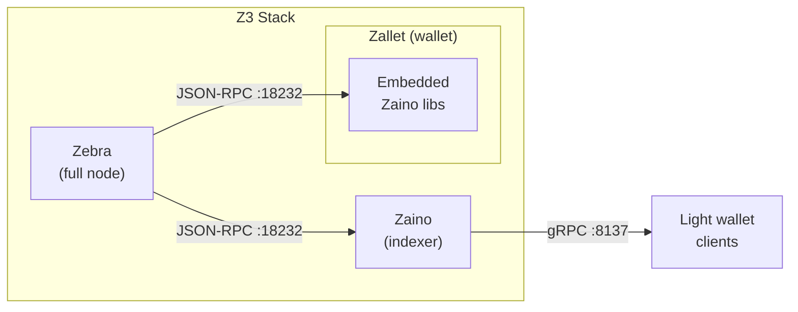

# Z3 — Unified Zcash Stack

Three services replacing the legacy `zcashd`: **Zebra** (full node), **Zaino** (indexer), and **Zallet** (wallet). Orchestrated via Docker Compose with sensible defaults that work out of the box.

## Quick Start

```bash
git clone https://github.com/ZcashFoundation/z3 && cd z3

# Seed config files and generate required credentials
cp -n config/zallet.toml.default config/zallet.toml
openssl req -x509 -newkey rsa:4096 -keyout config/tls/zaino.key -out config/tls/zaino.crt \
  -sha256 -days 365 -nodes -subj "/CN=localhost" \
  -addext "subjectAltName=DNS:localhost,DNS:zaino,IP:127.0.0.1"
rage-keygen -o config/zallet_identity.txt

# Start Zebra first — it must sync before other services can start
# Mainnet: 24-72 hours | Testnet: 2-12 hours
docker compose up -d zebra

# Monitor sync (returns "ok" when ready)
curl http://localhost:8080/ready

# Once Zebra is synced, start the full stack
docker compose up -d
```

Pre-built images for all 3 services are pulled automatically. No build step or submodule init needed.

> [!WARNING]
> The TLS certificate, identity file, and zallet config must exist before running any `docker compose` command. Run the setup steps above first — if any file is missing, Compose will fail.

> [!IMPORTANT]
> Zebra must sync the blockchain before Zaino and Zallet can start. Running `docker compose up -d` on a fresh install without syncing Zebra first will cause the other services to fail repeatedly. Start Zebra alone, wait for sync, then start the rest.

**Already have synced Zebra data?** Start everything immediately:

```bash
docker compose up -d
docker compose ps    # verify all healthy
```

> [!TIP]
> **Apple Silicon users:** Set `DOCKER_PLATFORM=linux/arm64` for native Z3 services. The optional zcashd profile has a separate platform setting.

## Deployment Modes

The stack supports 3 network modes. Mainnet runs with zero configuration; testnet and regtest require a few overrides.

| Mode | Command | Use case |
|------|---------|----------|
| **Mainnet** | `docker compose up -d` | Production, syncs the live Zcash blockchain |
| **Testnet** | Create `.env` with `NETWORK_NAME=Testnet` | Testing against the public test network |
| **Regtest** | `docker compose --env-file .env.regtest up -d` | Local development, instant blocks, no sync wait |

### Running Testnet

Create a `.env` file with the variables that differ from mainnet:

```bash
echo "NETWORK_NAME=Testnet" > .env
```

Update `config/zallet.toml` to set `network = "test"` in the `[consensus]` section, then start the stack normally.

### Running Regtest

Regtest uses a compose overlay (`docker-compose.regtest.yml`) that adds the rpc-router service, switches from cookie auth to username/password auth, and adjusts healthchecks for a peerless network. Volumes are automatically isolated via `COMPOSE_PROJECT_NAME=z3-regtest`.

First-time setup (**required** before starting the stack):

```bash
# Initialize wallet, generate RPC auth, and mine the first block
./scripts/regtest-init.sh

# Start the full regtest stack
docker compose --env-file .env.regtest up -d
```

The init script generates the Zallet RPC password hash, starts Zebra, mines the first block, and initializes the Zallet wallet. It is safe to re-run — it skips steps that are already done. Subsequent runs only need the last command.

See [docs/regtest.md](docs/regtest.md) for test commands (curl, grpcurl) and the full workflow reference.

### Optional zcashd Comparator

`zcashd` is available behind an opt-in Compose profile for local comparison tests. It is not part of the default Z3 stack, uses a separate data volume, exposes RPC on `http://localhost:38232`, and starts with public P2P disabled (`-listen=0 -connect=0`).

```bash
# Mainnet/testnet-style comparator
docker compose --profile zcashd up -d zcashd

# Regtest comparator with the regtest overlay
docker compose --env-file .env.regtest --profile zcashd up -d zcashd
```

The default image is `zodlinc/zcashd:v6.12.1`. Default RPC credentials are `zebra` / `zebra`; override them with `ZCASHD_RPCUSER` and `ZCASHD_RPCPASSWORD`. For custom regtest runs, zcashd activation heights can be overridden with `ZCASHD_*_ACTIVATION_HEIGHT` variables; use a separate `Z3_ZCASHD_DATA_PATH` when changing them.

### Monitoring Stack

Prometheus, Grafana, Jaeger, and AlertManager are available behind a Docker Compose profile. Zebra metrics must be explicitly enabled for Prometheus to have data to scrape.

Add to your `.env` (or `.env.regtest` for regtest):

```bash
ZEBRA_METRICS__ENDPOINT_ADDR=0.0.0.0:9999
```

Then start with the monitoring profile:

```bash
# Mainnet/Testnet
docker compose --profile monitoring up -d

# Regtest
docker compose --env-file .env.regtest --profile monitoring up -d
```

Access Grafana at `http://localhost:3000` (admin/admin), Prometheus at `http://localhost:9094`, and Jaeger at `http://localhost:16686`.

## Architecture



**Zebra** syncs and validates the Zcash blockchain. **Zaino** provides a lightwalletd-compatible gRPC interface for light wallet clients like Zingo. **Zallet** embeds Zaino's indexer libraries internally and connects directly to Zebra's JSON-RPC; it does not use the standalone Zaino service.

All images can be overridden via environment variables (`ZEBRA_IMAGE`, `ZAINO_IMAGE`, `ZALLET_IMAGE`, `ZCASHD_IMAGE`). See `.env.example` for all available options.

| Service | Default Image | Source |
|---------|---------------|--------|
| Zebra | `zfnd/zebra:4.3.1` | [ZcashFoundation/zebra](https://github.com/ZcashFoundation/zebra) |
| Zaino | `ghcr.io/zcashfoundation/zaino:sha-83e41d7` | [zingolabs/zaino](https://github.com/zingolabs/zaino) |
| Zallet | `electriccoinco/zallet:v0.1.0-alpha.3` | [zcash/wallet](https://github.com/zcash/wallet) |
| zcashd | `zodlinc/zcashd:v6.12.1` | [zcash/zcash](https://github.com/zcash/zcash) |

## Prerequisites

- [Docker Engine](https://docs.docker.com/engine/install/) with [Docker Compose](https://docs.docker.com/compose/install/) (v2.24.0+)
- [rage](https://github.com/str4d/rage/releases) for generating Zallet encryption keys
- Git for cloning the repository

> [!NOTE]
> **Linux users** may need `sudo` for Docker commands, or add your user to the `docker` group. See [Docker's post-installation steps](https://docs.docker.com/engine/install/linux-postinstall/#manage-docker-as-a-non-root-user).

## Service Endpoints

Once running, services are available at:

| Service | Endpoint | Default Port |
|---------|----------|-------------|
| Zebra RPC | `http://localhost:18232` | `Z3_ZEBRA_HOST_RPC_PORT` |
| Zebra Health | `http://localhost:8080/ready` | `Z3_ZEBRA_HOST_HEALTH_PORT` |
| Zaino gRPC | `localhost:8137` | `ZAINO_HOST_GRPC_PORT` |
| Zaino JSON-RPC | `http://localhost:8237` | `ZAINO_HOST_JSONRPC_PORT` |
| Zallet RPC | `http://localhost:28232` | `ZALLET_HOST_RPC_PORT` |
| zcashd RPC | `http://localhost:38232` | `ZCASHD_HOST_RPC_PORT` |

## Stopping the Stack

```bash
docker compose down                # stop containers, keep data
docker compose down -v             # stop and delete all volumes (full reset)
```

---

## Reference

The sections below cover setup details, configuration, and operational topics. Expand the section you need.

<details>
<summary><strong>System Requirements</strong></summary>

### Minimum

- **CPU:** 2 cores (4+ recommended)
- **RAM:** 4 GB for Zebra alone; 8+ GB for the full stack
- **Disk:** Mainnet ~300 GB, Testnet ~30 GB (SSD strongly recommended)
- **Network:** Reliable internet; initial mainnet sync downloads ~300 GB

### Recommended

- **CPU:** 4+ cores
- **RAM:** 16+ GB
- **Disk:** 500+ GB with room for blockchain growth
- **Network:** 100+ Mbps, ~300 GB/month bandwidth

### Sync Times

| Network | First sync | With existing data |
|---------|-----------|-------------------|
| Mainnet | 24-72 hours | Minutes |
| Testnet | 2-12 hours | Minutes |

Based on [Zebra's official requirements](https://zebra.zfnd.org/user/requirements.html). Zaino adds additional resource overhead; specific requirements are under determination.

</details>

<details>
<summary><strong>Setup Details</strong></summary>

### Submodules

Pre-built images are used by default. To build from source instead:

```bash
git submodule update --init --recursive
docker compose build
```

### TLS Certificates (Required)

Zaino's gRPC endpoint uses TLS. Generate a self-signed certificate:

```bash
openssl req -x509 -newkey rsa:4096 \
  -keyout config/tls/zaino.key -out config/tls/zaino.crt \
  -sha256 -days 365 -nodes -subj "/CN=localhost" \
  -addext "subjectAltName=DNS:localhost,DNS:zaino,IP:127.0.0.1"
```

For production, use certificates from a trusted CA.

### Zallet Identity File (Required)

```bash
rage-keygen -o config/zallet_identity.txt
```

Back up this file and the public key printed to the terminal.

### Zallet Configuration

Review `config/zallet.toml` and set the network in the `[consensus]` section:

- Mainnet: `network = "main"`
- Testnet: `network = "test"`

Zallet embeds Zaino's indexer libraries and connects directly to Zebra's JSON-RPC endpoint.

Critical requirements for `config/zallet.toml`:

- `validator_address` must point to `zebra:18232` (Zebra's JSON-RPC), not `zaino:8137`
- All TOML sections must be present: `[builder]`, `[consensus]`, `[database]`, `[external]`, `[features]`, `[indexer]`, `[keystore]`, `[note_management]`, `[rpc]`
- Cookie authentication must be configured in both TOML and mounted as a volume

### Platform Configuration (ARM64)

Z3 defaults to AMD64 for consistency. On Apple Silicon or ARM64 Linux, enable native Zebra, Zaino, and Zallet images:

```bash
echo "DOCKER_PLATFORM=linux/arm64" >> .env
```

The optional zcashd service has a separate `ZCASHD_DOCKER_PLATFORM` setting. Keep the default `linux/amd64` when using `zodlinc/zcashd:v6.12.1`; Docker Desktop runs it through emulation on Apple Silicon. Only set `ZCASHD_DOCKER_PLATFORM=linux/arm64` when `ZCASHD_IMAGE` points to an arm64-capable image.

</details>

<details>
<summary><strong>Configuration Reference</strong></summary>

### Defaults-in-Compose

Every variable in `docker-compose.yml` has a default via `${VAR:-default}`. The stack works with zero configuration files. Create `.env` only to override specific values.

Precedence (highest wins):

1. Shell environment variables
2. `.env` file values
3. Compose file defaults

### Variable Naming

Variables follow a 3-tier naming system to avoid collisions:

| Prefix | Scope | Example |
|--------|-------|---------|
| `Z3_*` | Infrastructure (volumes, ports); never passed to containers | `Z3_ZEBRA_DATA_PATH` |
| Unprefixed | Shared config, remapped per service in compose | `NETWORK_NAME`, `ENABLE_COOKIE_AUTH` |
| `ZEBRA_*`, `ZAINO_*`, `ZALLET_*` | Service-specific application config | `ZEBRA_TRACING__FILTER` |

### Common Overrides

```bash
# Network
NETWORK_NAME=Testnet

# Log levels
Z3_ZEBRA_RUST_LOG=debug
ZAINO_RUST_LOG=debug

# Ports
Z3_ZEBRA_HOST_RPC_PORT=28232
ZAINO_HOST_GRPC_PORT=9137

# Images
ZEBRA_IMAGE=zfnd/zebra:5.0.0
```

See `.env.example` for all available variables.

</details>

<details>
<summary><strong>Data Storage and Volumes</strong></summary>

### Docker Named Volumes (Default)

The stack uses Docker-managed named volumes by default:

| Volume | Contents |
|--------|----------|
| `zebra_data` | Blockchain state (~300 GB mainnet, ~30 GB testnet) |
| `zaino_data` | Indexer database |
| `zallet_data` | Wallet database |
| `zcashd_data` | Optional zcashd comparator chain state |
| `shared_cookie_volume` | RPC authentication cookies |

### Local Directories (Advanced)

For backups, external SSDs, or shared storage, override volume paths in `.env`:

```bash
Z3_ZEBRA_DATA_PATH=/mnt/ssd/zebra-state
Z3_ZAINO_DATA_PATH=/mnt/ssd/zaino-data
Z3_ZALLET_DATA_PATH=/mnt/ssd/zallet-data
Z3_ZCASHD_DATA_PATH=/mnt/ssd/zcashd-data
```

Fix permissions before starting:

```bash
./scripts/fix-permissions.sh zebra /mnt/ssd/zebra-state
./scripts/fix-permissions.sh zaino /mnt/ssd/zaino-data
./scripts/fix-permissions.sh zallet /mnt/ssd/zallet-data
./scripts/fix-permissions.sh zcashd /mnt/ssd/zcashd-data
```

Zebra, Zaino, Zallet, and zcashd each run as a specific non-root user. Directories must have correct ownership (set by the script) and 700 permissions. Never use 755 or 777.

</details>

<details>
<summary><strong>Health Checks and Sync Strategy</strong></summary>

### Two-Phase Deployment

Zebra's blockchain sync takes hours to days. Docker Compose healthcheck timeouts cannot accommodate this, so the stack uses a two-phase approach:

1. Start Zebra alone (`docker compose up -d zebra`)
2. Wait for sync (`curl http://localhost:8080/ready` returns "ok")
3. Start the full stack (`docker compose up -d`)

### Health Endpoints

Zebra exposes 2 endpoints on port 8080:

| Endpoint | Returns 200 when | Use for |
|----------|-------------------|---------|
| `/healthy` | Has minimum peer connections | Liveness monitoring, restart decisions |
| `/ready` | Synced within 2 blocks of tip | Production readiness, dependency gating |

### Service Dependency Chain

```
Zebra (/ready — synced near tip)
  → Zaino (gRPC port responding)
    → Zallet (RPC responding)
```

The default compose configuration gates Zaino and Zallet on Zebra's `/ready` endpoint. For development, copy `docker-compose.override.yml.example` to `docker-compose.override.yml` to switch to `/healthy` (allows services to start during sync, but they may error until Zebra catches up).

| Mode | Zebra healthcheck | Behavior |
|------|-------------------|----------|
| **Production** (default) | `/ready` | Two-phase: sync Zebra first, then start stack |
| **Development** (override) | `/healthy` | Start immediately; services may error during sync |

### Monitoring Sync Progress

```bash
curl http://localhost:8080/ready          # "ok" when synced
docker compose logs -f zebra              # watch logs
./scripts/check-zebra-readiness.sh        # polls until synced, prints status every 30s
```

What to expect during sync:
- Zebra shows `healthy (starting)` while syncing (during the 90-second grace period)
- Once synced, `/ready` returns `ok` and Zebra shows `healthy`
- Zaino and Zallet remain in `waiting` state until Zebra is ready

### Tuning Health Checks

```bash
# Adjust how many blocks behind the tip is acceptable (default: 2)
ZEBRA_HEALTH__READY_MAX_BLOCKS_BEHIND=2

# Minimum peer connections for /healthy (default: 1, set 0 for regtest)
ZEBRA_HEALTH__MIN_CONNECTED_PEERS=1

# Make /ready always return 200 on testnet even during sync (default: false)
ZEBRA_HEALTH__ENFORCE_ON_TEST_NETWORKS=false
```

</details>

## Further Reading

- [docs/docker-architecture.md](docs/docker-architecture.md): Design decisions, Compose patterns, and rationale behind the stack's configuration
- [docs/regtest.md](docs/regtest.md): Regtest environment setup, test commands (curl, grpcurl), and workflow reference
- [.env.example](.env.example): All available environment variable overrides
